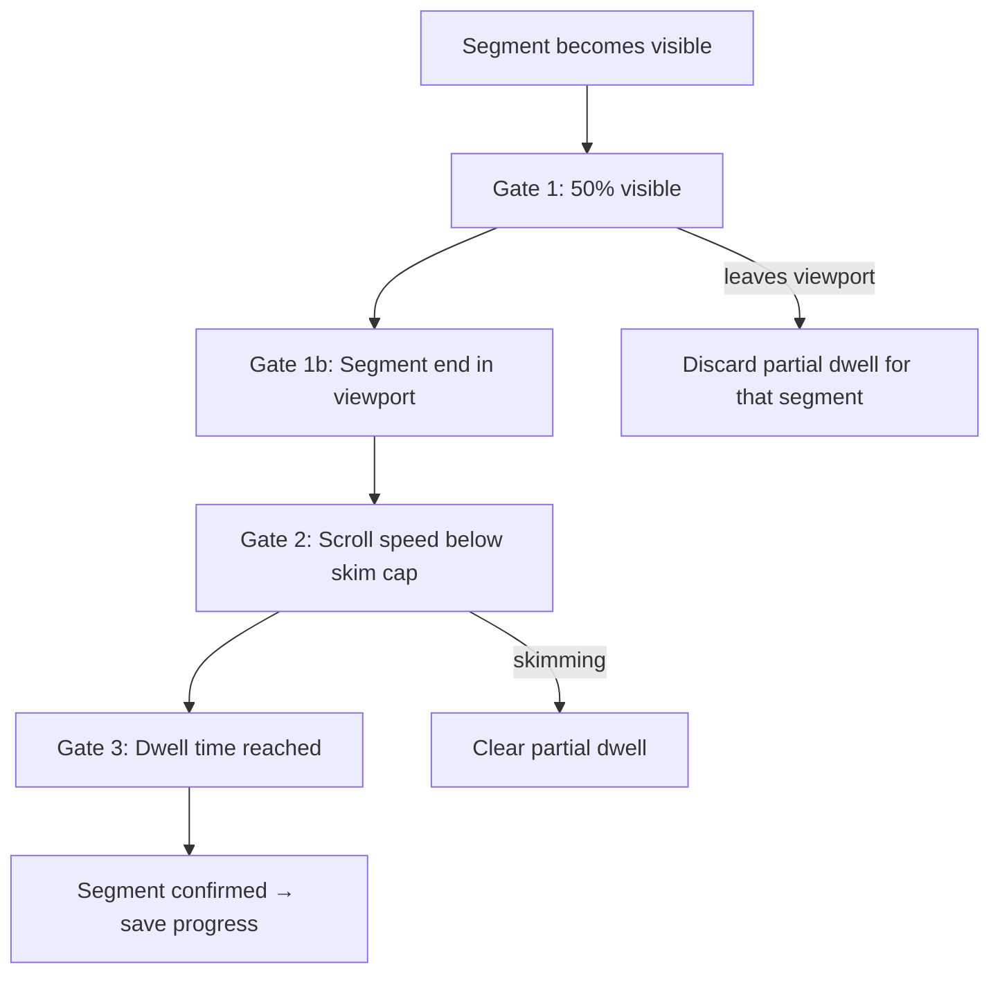

# Reading progress tracker

**Related**

- App handbook (setup and env): [`app/README.md`](../../app/README.md)
- Implementation: [`app/src/composables/useReadingProgressTracker.ts`](../../app/src/composables/useReadingProgressTracker.ts)

The app tracks how far a user has read through the **text body** of a content page and saves that progress locally. The homepage **Continue** row shows content still in progress (reading and/or video). Video (or audio) on the same page does not disable tracking when text is present.

Progress is measured **segment by segment**. A segment is only counted as read when the user has actually spent time on it — not when they scroll past quickly.

Visual overview: [`reading-progress-tracker.drawio.svg`](reading-progress-tracker.drawio.svg) (open in [draw.io](https://app.diagrams.net/)).

---

## When tracking runs

Tracking is enabled on **SingleContent** when:

- The content has **text** (`content.text`)
- A content id is present

This applies to text-only posts and to posts that also have a video — only the article body blocks are measured, not video playback.

The tracker watches `articleProseRef` — the `<div v-html="text">` that renders the CMS article body.

| Included in progress | Not included |
|----------------------|--------------|
| `p`, `h1`–`h4`, `li`, `blockquote`, `pre` inside the article body | Page title, hero image, summary, author, reading time, publish date, tags, copyright footer |

Progress starts at the **first segment in the article body**. If the HTML begins with an `<h2>`, that heading is segment 1.

---

## Segments (viewport-capped blocks)

Each prose DOM node (`p`, heading, etc.) becomes one or more **tracking segments**:

- If the rendered element height fits within the scroll container’s `clientHeight`, it is a single segment.
- If the element is taller than the viewport (e.g. a long paragraph on a phone), it is split into equal-height bands — each band is at most one viewport tall.

This ensures gate 1b (segment bottom in viewport) can pass on small screens. The prose HTML is **not** modified.

On resize or rotation, segments are re-collected and progress is re-seeded from the saved percentage so it does not drop.

---

## How progress is calculated

```
progress % = round(confirmed segments ÷ total segments × 100)
```

1. On article open, the tracker collects segments from the prose root.
2. Each segment must pass **three gates** before it is added to the `confirmed` set.
3. When the confirmed count changes, the percentage is saved to `localStorage` (`contentProgress` key, `reading` field on the content entry).
4. At **100%**, the entry is **removed** — the article is finished, not “in progress”.
5. Progress **never decreases** for a given article (`Math.max(existing, computed)`).

On re-open, the saved percentage **seeds** the confirmed set so progress does not drop if the tracker re-initializes.

---

## The three gates

A segment is confirmed only when **all** gates pass at the same time.



### Gate 1 — Visibility

- At least **50%** of the **segment** must be visible in the scroll container (`READING_INTERSECTION_RATIO = 0.5`).
- The scroll root is `<main>` when it scrolls (`resolveArticleScrollContainer()`), not the window.
- When a segment leaves the viewport, any partial dwell for that segment is discarded.

### Gate 1b — Segment end in viewport

- The **bottom edge** of the segment band must be inside the visible scroll area.
- This ensures the user has scrolled through the segment, not just glimpsed the top.

### Gate 2 — Scroll speed (skim detection)

Dwell only accumulates while the user is scrolling slowly enough to be reading. Fast scrolling is treated as **skimming**.

Scroll speed is measured in **words per second**, derived from the segment’s **rendered layout** on the current device. This keeps skim detection consistent across phone, tablet, and desktop without a separate viewport lookup.

#### Step 1 — Word density per segment

When a segment becomes eligible, cache its vertical word density (recomputed on each intersection update, including resize/rotate):

```
segmentWords  = round((segmentHeight / elementHeight) × countWords(element))
wordsPerPixel = segmentWords / segmentHeight     (0 when height is 0)
```

Font size, zoom, and line wrapping are already reflected in the rendered heights.

#### Step 2 — Words per second

On each scroll event, use the **active segment** — the topmost unread segment that passes gates 1 and 1b:

```
wordsScrolled   = abs(scrollDeltaY) × wordsPerPixel
wordsPerSecond  = wordsScrolled / (deltaMs / 1000)
```

If no segment is visible (`wordsPerPixel = 0`), scroll speed is not evaluated.

Scroll samples shorter than **50 ms** are batched first (`READING_MIN_SCROLL_SAMPLE_MS`) so fast trackpad flings are not missed between events.

#### Step 3 — Skim cap

```
maxWordsPerSec = (languageWPM / 60) × READING_SKIM_WPM_MULTIPLIER
```

| Language WPM | Reading rate | Skim cap (×3) |
|--------------|--------------|---------------|
| 200 (default) | ~3.3 w/s | ~10 w/s |
| 300 | ~5.0 w/s | ~15 w/s |

`languageWPM` comes from the content language’s `averageReadingSpeed`, defaulting to **200** when unset.

When `wordsPerSecond > maxWordsPerSec`:

- dwell stops accumulating
- all partial dwell is cleared
- when scrolling slows or stops (no scroll for 50 ms), dwell starts fresh for the active segment

### Gate 3 — Dwell time

Dwell is accumulated in **milliseconds** on each animation frame while gates 1, 1b, and 2 pass. It is not a single `setTimeout`.

Only the **active segment** (topmost unread eligible segment) accumulates dwell at a time. Other visible segments wait until earlier segments are confirmed.

Required dwell per segment:

```
dwellMs = (segmentWordCount ÷ languageWPM) × 60 000
clamped to 500 ms … 8 000 ms
```

| Constant | Value | Purpose |
|----------|-------|---------|
| `READING_MIN_DWELL_MS` | 500 ms | Minimum time even for tiny segments |
| `READING_MAX_DWELL_MS` | 8000 ms | Cap for very long segments |

When accumulated dwell reaches the threshold, the segment is confirmed and progress is saved (if the percentage increased).

**Short articles:** If every segment is already visible without scrolling (e.g. on a large desktop screen), dwell still accumulates via the animation-frame loop.

---

## Active segment

The **active segment** is the first segment in document order that is:

- visible and eligible (gates 1 + 1b), and
- not yet confirmed

It drives both **skim detection** (whose `wordsPerPixel` to use) and **dwell accumulation** (only this segment gains dwell per frame).

---

## Storage

**Key:** `localStorage.contentProgress`

**Shape:**

```json
[
  {
    "contentId": "…",
    "updatedAt": 1710000000000,
    "watching": { "mediaId": "…", "progress": 90, "duration": 180 },
    "reading": { "progress": 42 }
  }
]
```

Each entry is keyed by `contentId`. `watching` tracks video/audio playback (seconds); `reading` tracks article progress (0–100%). Both can be present on the same content. Entries are ordered by most recently updated; at most **10** are kept.

On first load, legacy `readingProgress` and `mediaProgress` keys are merged into `contentProgress` and removed.

**API** (`app/src/globalConfig.ts`):

- `setReadingProgress(contentId, progress)` / `getReadingProgress(contentId)` / `removeReadingProgress(contentId)`
- `setMediaProgress(mediaId, contentId, progress, duration)` / `getMediaProgress` / `removeMediaProgress`
- `contentProgressAsRef` — reactive list for the homepage row
- `syncContentProgressFromStorage()` / `watchContentProgressStorage()`

**Homepage:** `ContinueProgress.vue` reads `contentProgressAsRef`, queries published content by id, and renders a horizontal tile row (video and reading in progress together).

---

## Return visit — optional continue prompt

When the user reopens an in-progress article, a **Continue reading** card slides in from the right on SingleContent (not the notification system). The user chooses:

- **Continue reading** — scrolls to the saved position after **300 ms**
- **Start from top** — dismisses the prompt; saved progress is kept

During programmatic restore, for **400 ms** (`READING_RESTORE_GUARD_MS`), tracking is suppressed so the scroll jump does not count as reading.

---

## Future: time-on-article analytics

Recording how long a user spends on an article (idle pause, total read time) is deferred to a follow-up ticket. The segment + dwell model is designed to support that later.

---

## Source files

| File | Role |
|------|------|
| `app/src/pages/SingleContent/SingleContent.vue` | Wires the tracker and continue prompt |
| `app/src/composables/useReadingProgressTracker.ts` | Segments, gates, dwell loop, scroll restore |
| `app/src/util/readingTime.ts` | WPM, dwell math, words/sec skim cap |
| `app/src/globalConfig.ts` | `localStorage` read/write (`contentProgress`) |
| `app/src/components/HomePage/ContinueProgress.vue` | Homepage row |
| `app/src/components/content/ContinueReadingPrompt.vue` | In-article resume prompt |

---

## Constants

| Constant | Value | Meaning |
|----------|-------|---------|
| `READING_INTERSECTION_RATIO` | `0.5` | Segment must be half visible |
| `READING_SKIM_WPM_MULTIPLIER` | `3` | Skim cap = 3× language reading rate (w/s) |
| `READING_MIN_SCROLL_SAMPLE_MS` | `50` | Batch scroll events before words/s check |
| `READING_RESTORE_GUARD_MS` | `400` | Ignore tracking after programmatic restore |
| `READING_MIN_DWELL_MS` | `500` | Minimum dwell per segment |
| `READING_MAX_DWELL_MS` | `8000` | Maximum dwell per segment |
| `DEFAULT_READING_SPEED_WPM` | `200` | Fallback when language has no WPM |
| `READING_BLOCK_END_TOLERANCE_PX` | `4` | Subpixel tolerance for segment-end check |

---

## Tests

- `app/src/composables/useReadingProgressTracker.spec.ts` — segments, gates, dwell, skim, restore
- `app/src/util/readingTime.spec.ts` — dwell and words/sec math
- `app/src/components/content/ContinueReadingPrompt.spec.ts` — resume prompt UI

```sh
cd app && npm run test -- src/util/readingTime.spec.ts src/composables/useReadingProgressTracker.spec.ts src/components/content/ContinueReadingPrompt.spec.ts
```
