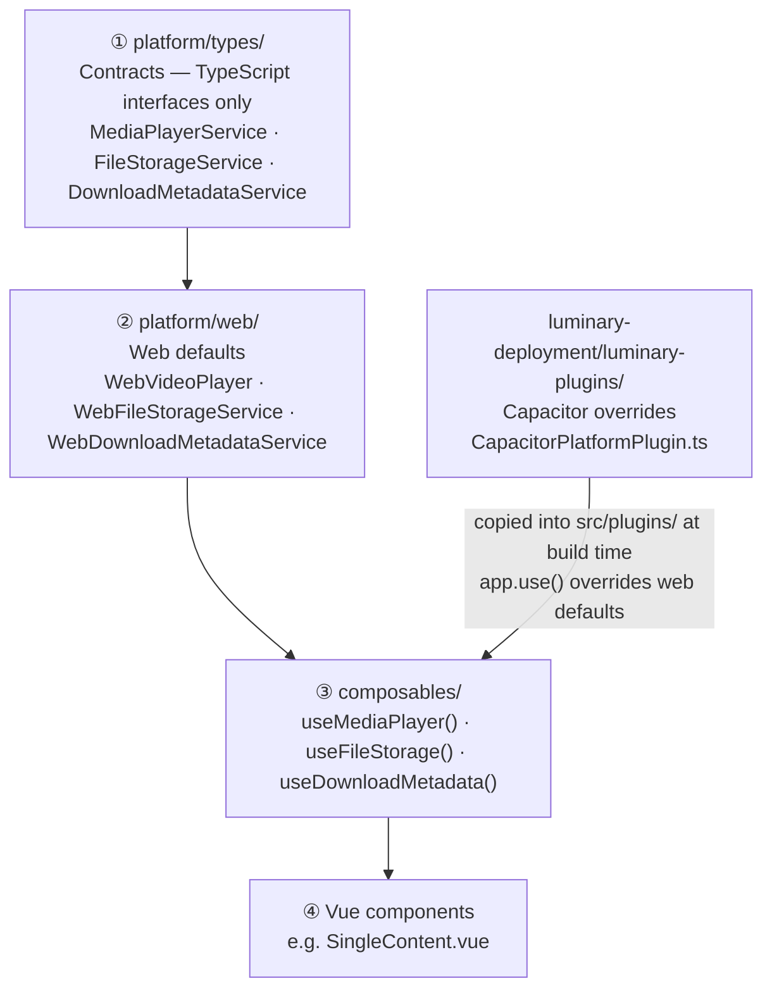
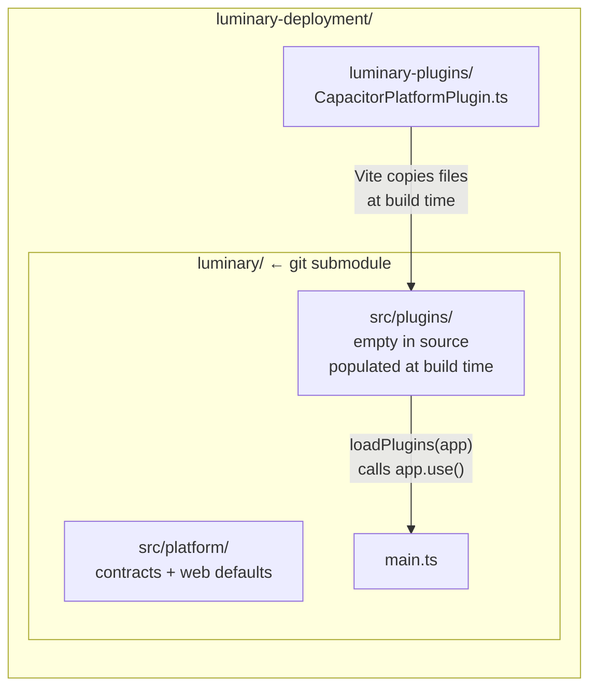
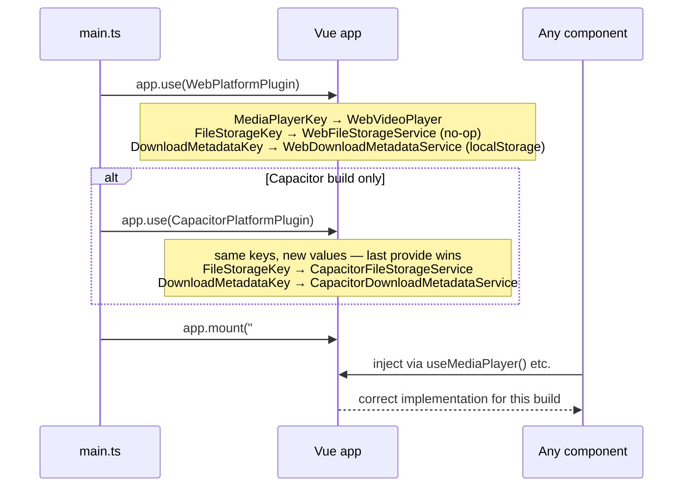
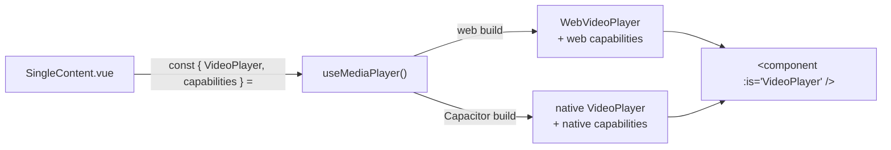
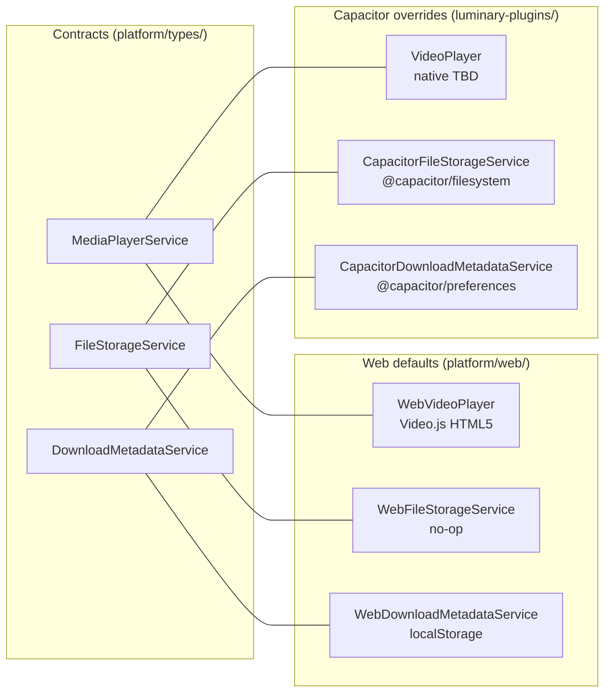
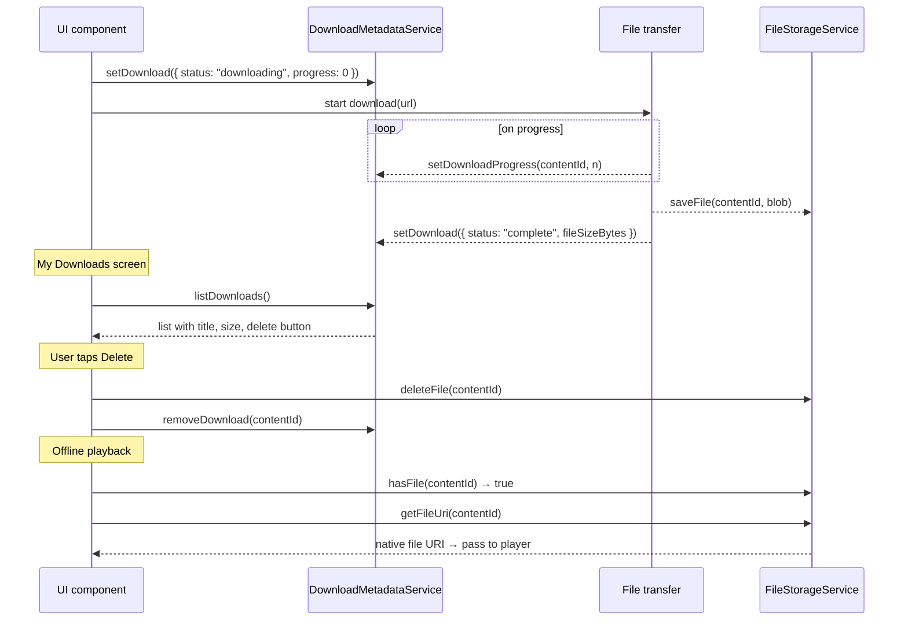

# Platform Plugin System

## The big picture

The app runs in two different environments:

- **Web / PWA** — runs in a browser. Has no access to native device APIs.
- **Capacitor (iOS / Android)** — wraps the app in a native shell. Has access to the filesystem, native media player, background audio, etc.

Some features work differently — or not at all — depending on the environment. The goal of this system is to let **components stay the same** regardless of the environment. They call a composable, get the right implementation back, and never need to check which platform they are on.

---

## Architecture overview



---

## How the two repositories connect



> There is no runtime connection between the two repos. By the time the app runs, everything has been compiled into a single bundle.

---

## Startup sequence



---

## Component usage



---

## Service map



---

## Offline download flow



---

## A concrete example

Without this system, every component that touches platform features becomes a mess:

```vue
<!-- ❌ before -->
<WebVideoPlayer v-if="isWeb" ... />
<CapacitorVideoPlayer v-else ... />
```

With this system, the component never checks the platform:

```vue
<!-- ✅ after -->
<script setup>
const { VideoPlayer, capabilities } = useMediaPlayer();
</script>

<template>
  <component :is="VideoPlayer" :content="content" />

  <!-- shown only on Capacitor, no platform check needed -->
  <DownloadButton v-if="capabilities.offline.downloads" />
</template>
```

---

## Capability flags

| Flag | Web | Capacitor |
|---|---|---|
| `playback.nativePlayback` | `false` | `true` |
| `playback.nativeFullscreen` | `false` | `true` |
| `playback.pictureInPicture` | `true` | `true` |
| `playback.backgroundAudio` | `false` | `true` |
| `playback.seekControl` | `true` | `true` |
| `playback.playbackRateControl` | `true` | `true` |
| `tracks.audioTrackSelection` | `true` | `true` |
| `offline.downloads` | `false` | `true` |
| `offline.progressTracking` | `false` | `true` |
| `offline.deleteDownloadedMedia` | `false` | `true` |

---

## File structure

```
platform/
  types/
    index.ts                         re-exports everything — add one line per new service
    mediaPlayer.ts                   MediaPlayerService type + MediaPlayerKey
    fileStorage.ts                   FileStorageService type + FileStorageKey
    downloadMetadata.ts              DownloadMetadataService type + DownloadMetadataKey + DownloadEntry

  web/
    index.ts                         WebPlatformPlugin — registers all web implementations
    WebVideoPlayer.vue               Video.js player
    WebVideoPlayer.css               Video.js styles
    WebVideoPlayer.spec.ts           Player tests
    WebFileStorageService.ts         No-op implementation
    WebDownloadMetadataService.ts    localStorage implementation

composables/
  useMediaPlayer.ts                  → inject(MediaPlayerKey)
  useFileStorage.ts                  → inject(FileStorageKey)
  useDownloadMetadata.ts             → inject(DownloadMetadataKey)
```

The `platform/capacitor/` folder does **not** exist in this repo. All Capacitor implementations live in `luminary-deployment/luminary-plugins/`.

---

## Adding a new service

1. Create `src/platform/types/myService.ts` — define the TypeScript interface and export an `InjectionKey`.
2. Add `export * from "./myService"` to `src/platform/types/index.ts`.
3. Create `src/platform/web/WebMyService.ts` — implement the interface for the browser (can be no-op).
4. Register it inside `WebPlatformPlugin` in `src/platform/web/index.ts`.
5. Create `src/composables/useMyService.ts` — one line: `export const useMyService = () => inject(MyServiceKey)!`
6. In `luminary-deployment`, add the Capacitor implementation to `CapacitorPlatformPlugin.ts`.

`main.ts` does **not** need to change.

---

## Testing

Mock the composable — do not set up Vue providers in tests:

```ts
vi.mock("@/composables/useMediaPlayer", () => ({
    useMediaPlayer: () => ({
        VideoPlayer: { template: "<div data-testid='video-player' />" },
        capabilities: {
            playback: { nativePlayback: false, backgroundAudio: false, seekControl: true, playbackRateControl: true, pictureInPicture: true, nativeFullscreen: false },
            tracks:   { audioTrackSelection: true },
            offline:  { downloads: false, progressTracking: false, deleteDownloadedMedia: false },
        },
    }),
}));
```

---

## Rules

1. **Components import composables, never `platform/*` directly.**
2. **No `if (isNative)` in components.** Use capability flags instead.
3. **If a file imports `@capacitor/*`, it belongs in `luminary-deployment`**, not in this repo.
4. **Every service must have a web implementation**, even if it is a no-op.
5. **Add a capability flag only when the UI needs to branch on it.**
