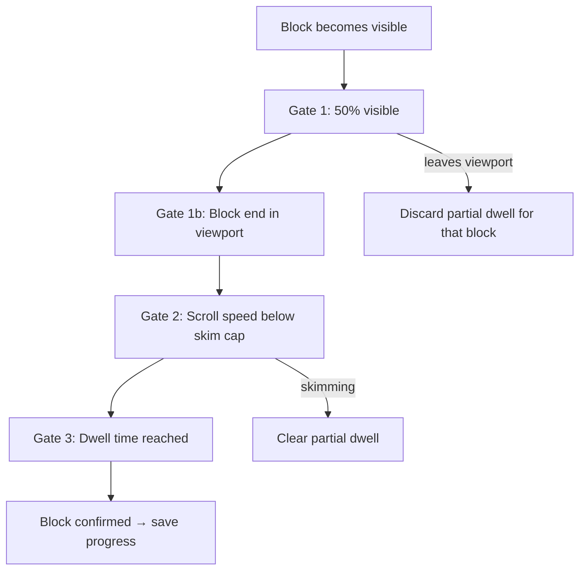

# Reading progress tracker

The app tracks how far a user has read through a **text article** and saves that progress locally. The homepage **Continue Reading** row shows articles that are still in progress.

Progress is measured **block by block**. A block is only counted as read when the user has actually spent time on it — not when they scroll past quickly.

Visual overview: [`reading-progress-tracker.drawio.svg`](reading-progress-tracker.drawio.svg) (open in [draw.io](https://app.diagrams.net/)).

---

## When tracking runs

Tracking is enabled on **SingleContent** when all of the following are true:

- The content has **text** (`content.text`)
- The content has **no video**
- A content id is present

The tracker watches `articleProseRef` — the `<div v-html="text">` that renders the CMS article body.

| Included in progress | Not included |
|----------------------|--------------|
| `p`, `h1`–`h4`, `li`, `blockquote`, `pre` inside the article body | Page title, hero image, summary, author, reading time, publish date, tags, copyright footer |

Progress starts at the **first block in the article body**. If the HTML begins with an `<h2>`, that heading is block 1.

---

## How progress is calculated

```
progress % = round(confirmed blocks ÷ total blocks × 100)
```

1. On article open, the tracker collects all blocks from the prose root.
2. Each block must pass **four gates** before it is added to the `confirmed` set.
3. When the confirmed count changes, the percentage is saved to `localStorage` (`readingProgress` key).
4. At **100%**, the entry is **removed** — the article is finished, not “in progress”.
5. Progress **never decreases** for a given article (`Math.max(existing, computed)`).

On re-open, the saved percentage **seeds** the confirmed set so progress does not drop if the tracker re-initializes.

---

## The four gates

A block is confirmed only when **all** gates pass at the same time.



### Gate 1 — Visibility

- At least **50%** of the block must be visible in the scroll container (`READING_INTERSECTION_RATIO = 0.5`).
- The scroll root is `<main>` when it scrolls (`resolveArticleScrollContainer()`), not the window.
- When a block leaves the viewport, any partial dwell for that block is discarded.

### Gate 1b — Block end in viewport

- The **bottom edge** of the block must be inside the visible scroll area.
- This ensures the user has scrolled through the block, not just glimpsed the top.

### Gate 2 — Scroll speed (skim detection)

Dwell only accumulates while the user is scrolling slowly enough to be reading. Fast scrolling is treated as **skimming**.

Scroll speed is measured in **words per second**, derived from the block’s **rendered layout** on the current device. This keeps skim detection consistent across phone, tablet, and desktop without a separate viewport lookup.

#### Step 1 — Word density per block

When a block becomes eligible, cache its vertical word density (recomputed on each intersection update, including resize/rotate):

```
wordCount     = countWords(block.textContent)
blockHeight   = block.getBoundingClientRect().height
wordsPerPixel = wordCount / blockHeight     (0 when height is 0)
```

Font size, zoom, and line wrapping are already reflected in `blockHeight`.

#### Step 2 — Words per second

On each scroll event, use the **active block** — the topmost unread block that passes gates 1 and 1b:

```
wordsScrolled   = abs(scrollDeltaY) × wordsPerPixel
wordsPerSecond  = wordsScrolled / (deltaMs / 1000)
```

If no block is visible (`wordsPerPixel = 0`), scroll speed is not evaluated.

Scroll samples shorter than **50 ms** are batched first (`READING_MIN_SCROLL_SAMPLE_MS`) so fast trackpad flings are not missed between events.

#### Step 3 — Skim cap

```
maxWordsPerSec = (languageWPM / 60) × READING_SKIM_WPM_MULTIPLIER
```

| Language WPM | Reading rate | Skim cap (×3) |
|--------------|--------------|---------------|
| 200 (default) | ~3.3 w/s | ~10 w/s |
| 300 | ~5.0 w/s | ~15 w/s |

`languageWPM` comes from the content language’s `averageReadingSpeed`, defaulting to **200** when unset.

When `wordsPerSecond > maxWordsPerSec`:

- dwell stops accumulating
- all partial dwell is cleared
- when scrolling slows or stops (no scroll for 50 ms), dwell starts fresh for the active block

### Gate 3 — Dwell time

Dwell is accumulated in **milliseconds** on each animation frame while gates 1, 1b, and 2 pass. It is not a single `setTimeout`.

Only the **active block** (topmost unread eligible block) accumulates dwell at a time. Other visible blocks wait until earlier blocks are confirmed.

Required dwell per block:

```
dwellMs = (blockWordCount ÷ languageWPM) × 60 000
clamped to 500 ms … 8 000 ms
```

| Constant | Value | Purpose |
|----------|-------|---------|
| `READING_MIN_DWELL_MS` | 500 ms | Minimum time even for tiny blocks |
| `READING_MAX_DWELL_MS` | 8000 ms | Cap for very long blocks |

When accumulated dwell reaches the threshold, the block is confirmed and progress is saved (if the percentage increased).

**Short articles:** If every block is already visible without scrolling (e.g. on a large desktop screen), dwell still accumulates via the animation-frame loop.

### Gate 4 — Idle pause

If there is no scroll or intersection activity for **45 s** (`READING_IDLE_MS`), dwell stops until the user interacts again.

---

## Active block

The **active block** is the first block in document order that is:

- visible and eligible (gates 1 + 1b), and
- not yet confirmed

It drives both **skim detection** (whose `wordsPerPixel` to use) and **dwell accumulation** (only this block gains dwell per frame).

---

## Storage

**Key:** `localStorage.readingProgress`

**Shape:**

```json
[{ "contentId": "…", "progress": 42 }]
```

**API** (`app/src/globalConfig.ts`):

- `setReadingProgress(contentId, progress)` — save or update
- `getReadingProgress(contentId)` — read percentage (0 if missing)
- `removeReadingProgress(contentId)` — called automatically at 100%

**Homepage:** `ContinueReading.vue` reads this list, queries published content by id, and renders a horizontal tile row.

---

## Return visit — scroll restore

When the user reopens an in-progress article:

1. After **300 ms**, the scroll container jumps to `progress%` of max scroll.
2. For **400 ms** after that (`READING_RESTORE_GUARD_MS`), tracking is suppressed so the programmatic scroll does not count as reading.

---

## Source files

| File | Role |
|------|------|
| `app/src/pages/SingleContent/SingleContent.vue` | Wires the tracker on text articles |
| `app/src/composables/useReadingProgressTracker.ts` | Gates, dwell loop, scroll restore |
| `app/src/util/readingTime.ts` | WPM, dwell math, words/sec skim cap |
| `app/src/globalConfig.ts` | `localStorage` read/write |
| `app/src/components/HomePage/ContinueReading.vue` | Homepage row |

---

## Constants

| Constant | Value | Meaning |
|----------|-------|---------|
| `READING_INTERSECTION_RATIO` | `0.5` | Block must be half visible |
| `READING_SKIM_WPM_MULTIPLIER` | `3` | Skim cap = 3× language reading rate (w/s) |
| `READING_MIN_SCROLL_SAMPLE_MS` | `50` | Batch scroll events before words/s check |
| `READING_RESTORE_GUARD_MS` | `400` | Ignore tracking after programmatic restore |
| `READING_IDLE_MS` | `45000` | Pause dwell after inactivity |
| `READING_MIN_DWELL_MS` | `500` | Minimum dwell per block |
| `READING_MAX_DWELL_MS` | `8000` | Maximum dwell per block |
| `DEFAULT_READING_SPEED_WPM` | `200` | Fallback when language has no WPM |
| `READING_BLOCK_END_TOLERANCE_PX` | `4` | Subpixel tolerance for block-end check |

---

## Tests

- `app/src/composables/useReadingProgressTracker.spec.ts` — gates, dwell, skim, restore
- `app/src/util/readingTime.spec.ts` — dwell and words/sec math

```sh
cd app && npm run test -- src/util/readingTime.spec.ts src/composables/useReadingProgressTracker.spec.ts
```
