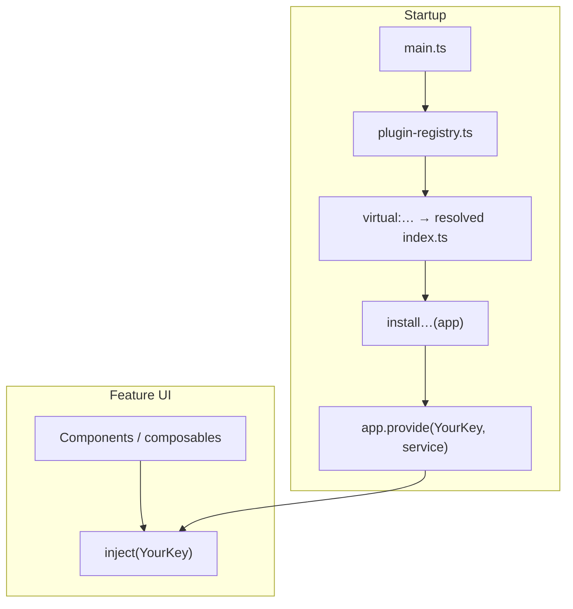

# Build-time plugin architecture (Luminary web app)

This document describes a **contract-driven** way to plug in behavior in the Vue app (`luminar/app`): **one TypeScript interface per concern**, **one implementation chosen when the bundle is built**, **`provide` / `inject`** for consumers, and **no feature code importing concrete adapter paths**.

**Related**

- App handbook (setup, extension plugins, env): [`app/README.md`](../../../app/README.md)
- Concrete file walkthrough using the repo’s first plugin: [`starter-code.md`](./starter-code.md)
- Diagram sources (open in [diagrams.net](https://app.diagrams.net/) / draw.io; export SVG if needed):
  - **[`vue-plugin-architecture.drawio`](./vue-plugin-architecture.drawio)** — components and swimlanes (build, bootstrap, provide/inject, checklist for a second plugin).
  - **[`vue-plugin-architecture-flow.drawio`](./vue-plugin-architecture-flow.drawio)** — **end-to-end flow** top to bottom: resolve → bundle → bootstrap → `provide` → `inject` (and how to repeat for another plugin).

---

## What we are optimizing for

- **Stable surface for UI** — Pages and components depend on an interface and an injection key, not on “web vs native” imports.
- **Small bundles** — Only the implementation for the active build is resolved; other adapters are not part of the graph.
- **Clear boundaries** — Contract, token, and installer live together under one folder per plugin; a small **registry** composes what gets registered on the app.

**Not covered by this pattern:** ad-hoc **extension classes** loaded via `VITE_PLUGINS` / `VITE_PLUGIN_PATH` (see **Extension plugins** in [`app/README.md`](../../../app/README.md)).

---

## Core pieces (generic)

| Piece | Role |
| --- | --- |
| **Contract** | TypeScript types + service interface (`contract.ts`). |
| **Token** | `InjectionKey<YourService>` in a file that does **not** import the virtual module (`token.ts`). UI imports the key from here for `inject` to avoid pulling the whole adapter graph into components. |
| **Implementation** | Class(es) under a target folder (e.g. `web/`) that satisfy the contract. |
| **Virtual entry** | `index.ts` per target: `install…(app)`, `app.provide(YourKey, instance)`, re-exports. This is what Vite resolves. |
| **Vite** | A plugin maps `virtual:<name>` → `plugins/<plugin>/{BUILD_TARGET}/index.ts`. |
| **Registry** | `app/src/core/plugin-registry.ts` imports `virtual:…` modules and exposes `app.use(appPluginsPlugin)` so bootstrap stays one place. |

### What `virtual:…` means

A **virtual module** is an **import id that does not point to a real file by itself** (for example `virtual:media-player`). At build time, a Vite plugin (`app/vite-plugins/buildTargetVirtuals.ts`) implements **`resolveId`**: when the bundler sees that id, the plugin returns an **absolute path** to the actual entry file (here: `plugins/<name>/{BUILD_TARGET}/index.ts`). Application code always imports the **same** virtual id; **which file** gets bundled follows **`BUILD_TARGET`** (and any rules you add in the plugin). See [Vite — Virtual Modules Convention](https://vite.dev/guide/api-plugin.html#virtual-modules-convention).

---

## Build time vs runtime

### Build time

Environment (e.g. **`BUILD_TARGET`**) selects **which subdirectory** under `plugins/<name>/` becomes the resolved module. Only that file tree is bundled for that plugin.

### Runtime



**Typical steps**

1. **`main.ts`** uses **`app.use(appPluginsPlugin)`** from `@/core/plugin-registry`.
2. The registry imports **`virtual:…`** (not `plugins/.../web/...` directly).
3. The resolved module runs **`install…(app)`**, which constructs the service and **`provide`s** it on the app.
4. Feature code **`inject(YourKey)`** and calls only the contract. Import **`YourKey`** from **`token.ts`**, not from the registry, so components do not depend on the virtual module’s dependency graph (see **Injection key** above).

---

## Repository shape (conceptual)

```text
app/
  vite-plugins/
    buildTargetVirtuals.ts     # maps virtual:… → plugins/<name>/{BUILD_TARGET}/index.ts
  src/
    core/
      plugin-registry.ts       # imports virtual modules; appPluginsPlugin
    plugins/
      <plugin-name>/
        contract.ts
        token.ts
        web/                     # or another BUILD_TARGET name
          … implementation …
          index.ts               # virtual module entry
```

---

## Configuration

| Variable | Where | Role |
| --- | --- | --- |
| **`BUILD_TARGET`** | `app/.env`, CI, or shell | Picks `plugins/<name>/{BUILD_TARGET}/index.ts` for each plugin that uses this mechanism. Not `VITE_*` — not on **`import.meta.env`** in the browser. |

Example:

```bash
BUILD_TARGET=web
```

---

## Adding another build-swapped plugin

Each new capability gets its **own** `virtual:<name>` id and **parallel** folder under `app/src/plugins/`. The media player is not special — the same steps apply to plugin #2, #3, and so on. The diagram at [`vue-plugin-architecture.drawio`](./vue-plugin-architecture.drawio) includes a **checklist swimlane** for this.

1. **Scaffold `app/src/plugins/<name>/`**
   - **`contract.ts`** — interface + types for the service.
   - **`token.ts`** — `InjectionKey<…>` only (no import from `virtual:…`).
   - **`web/index.ts`** (and other targets as needed) — `install<Name>(app)` that **`provide`**s the implementation under the key from `token.ts`, plus any re-exports the registry needs.

2. **Teach Vite the new id** — in **`app/vite-plugins/buildTargetVirtuals.ts`**, add another branch in **`resolveId`** (same pattern as `virtual:media-player`):

```ts
if (id === "virtual:downloads") {
    return `${root}/plugins/downloads/${buildTarget}/index.ts`;
}
```

3. **Type the virtual module** — in **`app/env.d.ts`**, add **`declare module "virtual:downloads"`** (or whatever id you chose) exporting **`install…`** and the injection key type, mirroring **`virtual:media-player`**.

4. **Wire bootstrap** — in **`app/src/core/plugin-registry.ts`**, **`import`** from **`virtual:downloads`**, call **`installDownloads(app)`** (or the name you export) inside **`installPlugins`**, and re-export keys/types if other modules should import them from one place.

5. **Use it in UI** — **`inject`** using the key imported from **`@/plugins/<name>/token`**, not from the virtual module.

**Order of `install*` calls** usually does not matter unless one plugin’s `install` depends on another’s `provide` being ready; keep dependencies explicit in **`installPlugins`**.

---

## Extension plugins (separate mechanism)

Optional class-based modules loaded by **`VITE_PLUGINS`** + **`VITE_PLUGIN_PATH`** are unrelated to **`virtual:…`**. See [`app/README.md`](../../../app/README.md).

---

## Testing

**`provide`** a mock implementation of the **contract** under the same **`InjectionKey`**. Mock the interface, not a file under `plugins/.../web/`.

---

## Example: global media player

The first (and currently only) plugin wired this way in the repo is the **global audio player**.

| Concept | In this repo |
| --- | --- |
| Virtual module | `virtual:media-player` |
| Contract | `MediaPlayerService` in `app/src/plugins/media-player/contract.ts` |
| Token | `MediaPlayerKey` in `app/src/plugins/media-player/token.ts` |
| Web implementation | `WebMediaPlayerService` in `plugins/media-player/web/media-player.web.ts`; entry `plugins/media-player/web/index.ts` |
| Consumers | e.g. `App.vue`, `AudioPlayer.vue` — **`inject(MediaPlayerKey)`**, key imported from **`token.ts`** |

Vite resolves **`virtual:media-player`** to **`app/src/plugins/media-player/{BUILD_TARGET}/index.ts`** (default **`web`**). More detail and snippets: [`starter-code.md`](./starter-code.md).

---

## References

- [Vue — Plugins](https://vuejs.org/guide/reusability/plugins.html)
- [Vue — Provide / inject](https://vuejs.org/guide/components/provide-inject)
