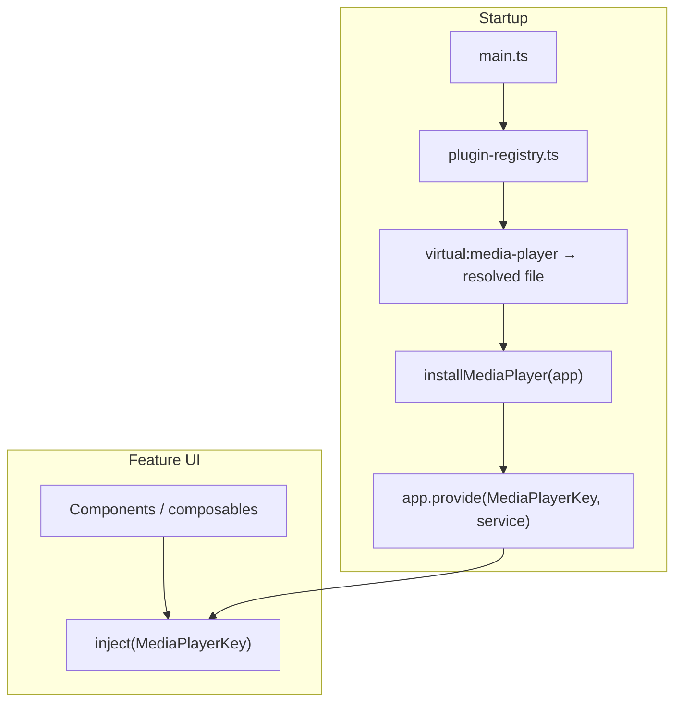

# Luminary app — media player plugin architecture

This document describes how the **web app** (`luminar/app`) wires the global **media player** behind a **TypeScript contract**, **`provide` / `inject`**, and a **build-time–selected implementation** (no runtime platform branching in feature code).

**Related**

- App handbook (setup, extension plugins, env): [`app/README.md`](../../../app/README.md)
- Illustrative starter sketches (older `platform/` shape): [`starter-code.md`](./starter-code.md)

---

## Goals

- **One contract** (`MediaPlayerService`) for all UI and composables.
- **One implementation per build** — Vite resolves `virtual:media-player` to a single folder (`web`, `capacitor`, …) so unused targets are not bundled.
- **No `if (Capacitor)` in pages** — differences belong in the chosen adapter or in capability flags on the service (e.g. `supportsBackgroundPlayback`).

**Out of scope here:** **Authentication** lives in `app/src/auth.ts` (Auth0). It is normal application code, not swapped via `BUILD_TARGET`. A separate **Capacitor shell** project may wrap the built web app; that does not require a `capacitor` folder in this repo unless you intentionally add a second build target here.

---

## End-to-end picture

### Build time

Vite plugin `app/vite-plugins/buildTargetVirtuals.ts` reads **`BUILD_TARGET`** from the environment (e.g. `app/.env`) and resolves the virtual id **`virtual:media-player`** to exactly one file:

`app/src/plugins/media-player/{BUILD_TARGET}/index.ts`

Default if unset: **`web`**.

### Runtime



**Steps**

1. **`main.ts`** calls `app.use(appPluginsPlugin)` from `@/core/plugin-registry`.
2. **`plugin-registry.ts`** imports from **`virtual:media-player`** (never from `plugins/media-player/web/...` directly).
3. The resolved module’s **`installMediaPlayer(app)`** creates the service and runs **`app.provide(MediaPlayerKey, service)`**.
4. **`AudioPlayer.vue`**, **`App.vue`**, etc. **`inject(MediaPlayerKey)`** and call only **`MediaPlayerService`** methods.

**Injection key import:** components import **`MediaPlayerKey`** from **`@/plugins/media-player/token`** (not from `plugin-registry`). The token module is shared by every build target and does not load the virtual implementation, which avoids a circular dependency: the web bundle wires `AudioPlayer.vue` into the service, while `AudioPlayer.vue` still needs the key for `inject`.

---

## Repository layout (current)

```text
app/
  vite-plugins/
    buildTargetVirtuals.ts     # BUILD_TARGET → path for virtual:media-player
  src/
    core/
      plugin-registry.ts       # installPlugins, appPluginsPlugin, re-exports MediaPlayerKey
    plugins/
      media-player/
        contract.ts            # MediaPlayerService + related types
        token.ts               # MediaPlayerKey (InjectionKey)
        web/
          media-player.web.ts  # WebMediaPlayerService
          index.ts             # installMediaPlayer, exports for virtual module
        capacitor/
          index.ts             # optional; another BUILD_TARGET (may re-export web)
    auth.ts                    # Auth0 — not part of this virtual module
```

---

## Configuration

| Variable | Where | Role |
| --- | --- | --- |
| **`BUILD_TARGET`** | `app/.env`, CI env, or shell when invoking Vite | Selects `plugins/media-player/{BUILD_TARGET}/index.ts`. Not a `VITE_*` variable — it is **not** exposed to `import.meta.env` in the browser. |

Example `app/.env`:

```bash
BUILD_TARGET=web
```

---

## Adding or changing an implementation

1. **Contract** — extend `app/src/plugins/media-player/contract.ts` only if the public API should change; keep it stable for UI code.
2. **Token** — `MediaPlayerKey` stays in `token.ts` so the same key is used for every build target.
3. **New target folder** — e.g. `plugins/media-player/native/index.ts` exporting the same **`installMediaPlayer`** + types as `web`, then set **`BUILD_TARGET=native`** when building.
4. **Vite** — extend `buildTargetVirtuals.ts` if you add new virtual module ids or path rules.

Do **not** import implementation files from `components/`; always go through **`inject(MediaPlayerKey)`** or types from **`plugin-registry`** / contract.

---

## Extension plugins (separate mechanism)

Optional class-based modules loaded by **`VITE_PLUGINS`** + **`VITE_PLUGIN_PATH`** are unrelated to `virtual:media-player`. See **Extension plugins** in [`app/README.md`](../../../app/README.md).

---

## Testing

Tests **`provide`** a mock **`MediaPlayerService`** under **`MediaPlayerKey`** (same as before). No change to the contract-testing idea: mock the interface, not a concrete class path.

---

## References

- [Vue — Plugins](https://vuejs.org/guide/reusability/plugins.html)
- [Vue — Provide / inject](https://vuejs.org/guide/components/provide-inject)
