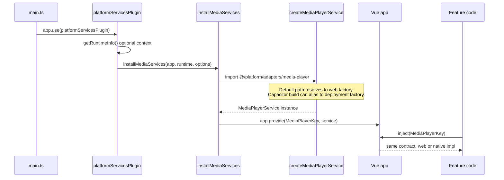

# Vue platform plugin architecture (Web + Capacitor)

This document describes how Luminary wires **platform-specific behavior** (browser vs Capacitor shell) using **Vue plugins**, **contracts**, and **`provide` / `inject`**, so feature code stays the same on every target.

**Companion files**

- Diagram (SVG): [`vue-plugin-architecture.drawio.svg`](./vue-plugin-architecture.drawio.svg)
- Starter scaffolding: [`starter-code.md`](./starter-code.md)

---

## What problem this solves

We want **one app codebase** where:

- **Web** uses safe, default implementations (DOM, fetch, etc.).
- **Capacitor** can use richer behavior (background audio, native plugins, in-app browser auth) **without** `if (isCapacitor)` scattered through pages and components.

The pattern: define a **small interface** once, register **one implementation per build**, and have features **inject** that API.

---

## How it works (end-to-end flow)



**Step-by-step (runtime)**

1. **`main.ts`** calls `app.use(platformServicesPlugin)` (and optional options).
2. **`platformServicesPlugin`** runs **`getRuntimeInfo()`** (e.g. `globalThis.Capacitor` in the shell) and forwards context to feature installers.
3. **`installMediaServices`** (and future installers) call **`createMediaPlayerService()`** from **`@/platform/adapters/media-player`**.
4. That module returns a concrete class implementing **`MediaPlayerService`** (web by default).
5. The installer **`app.provide(MediaPlayerKey, instance)`**.
6. Components and composables **`inject(MediaPlayerKey)`** and call the contract only.
7. **No platform branching** in consumers—only capability flags on the service if needed (`supportsBackgroundPlayback`, etc.).
8. **Capacitor-specific** implementations live under **`luminary-deployment/luminary-plugins`** (or are pointed to by build config); **luminary** stays free of **`@capacitor/core`** as a dependency.

**Build-time branch (Capacitor bundle)**

For some features, the **implementation module** itself is swapped when producing the native bundle:

- In **`app/vite.config.ts`**, **`VITE_MEDIA_PLAYER_ADAPTER_PATH`** can alias  
  `@/platform/adapters/media-player` → a file under `luminary-deployment` (e.g. `capacitorMediaPlayerAdapter.ts`).
- **Without** that variable, the import resolves to the default **`WebMediaPlayerService`** factory inside luminary.

So: **one import path in source**, **two possible bundles**, no copy-paste of `App.vue`.

---

## Repository layout

```text
luminary/app/src/
  platform/
    contracts/          # TypeScript interfaces (e.g. media-player.ts)
    tokens.ts           # InjectionKey symbols
    runtime.ts          # getRuntimeInfo() without importing @capacitor/core
    adapters/
      web/              # Browser implementations
      media-player/
        index.ts        # Default createMediaPlayerService() → web
    installers/         # installMediaServices, …
  plugins/
    platform-services.plugin.ts   # app.use() entry; calls installers

luminary-deployment/
  luminary-plugins/     # Capacitor integrations, auth, updater, optional adapter factories
```

There is **no** `adapters/capacitor/` inside **luminary** by design: native coupling stays in **deployment**.

---

## Selected pattern: Option A (single runtime plugin)

- **One** exported plugin: `platformServicesPlugin`.
- **Several internal installers**: `installMediaServices`, later `installDownloadServices`, etc.
- **`luminary-plugins`** remains the place for Capacitor-only or Capacitor-conditioned JS.

Other patterns (feature-scoped plugins, service registries) are documented as alternatives in research notes if you need to scale further.

---

## How to add a new platform service (“plugin”)

Use this checklist so new capabilities stay consistent with the media player precedent.

### 1. Define the contract

- Add **`app/src/platform/contracts/<feature>.ts`** with a focused interface (behavior + optional capability flags, no UI types).
- Prefer explicit methods and small types; add **`dispose`** / lifecycle only if needed.

### 2. Add an injection token

- Export **`export const MyFeatureKey: InjectionKey<MyFeatureService> = Symbol("MyFeatureService")`** in **`app/src/platform/tokens.ts`**.

### 3. Implement the web adapter

- Add **`app/src/platform/adapters/web/<feature>.web.ts`** (or under a small folder if multiple files).
- Implement the contract with browser APIs only.

### 4. Wire the default factory

- Either add **`app/src/platform/adapters/<feature>/index.ts`** with `createMyFeatureService()` returning the web implementation, **or** extend an existing aggregator that returns multiple services.
- Keep the **import path stable** (e.g. `@/platform/adapters/my-feature`) so Vite can alias it later if needed.

### 5. Register in the runtime plugin

- Add **`installMyFeatureServices(app, runtime, options?)`** under **`app/src/platform/installers/`**.
- Call it from **`platformServicesPlugin.install`** after **`getRuntimeInfo()`**.
- Inside the installer: **`app.provide(MyFeatureKey, createMyFeatureService(...))`**.

### 6. (Optional) Capacitor / deployment implementation

- Add a class under **`luminary-deployment/luminary-plugins/`** that implements the same contract (you may import **`@capacitor/core`** there).
- Export a factory with the **same signature** as the luminary default (e.g. `createMyFeatureService`).
- Point the Capacitor build at that module with a **Vite `resolve.alias`** (same idea as `VITE_MEDIA_PLAYER_ADAPTER_PATH`) **or** pass a factory through **`app.use(platformServicesPlugin, { createMyFeatureService })`** if you extend plugin options—pick one strategy per feature and document it in the installer comment.

### 7. Consume from features

- **`const svc = inject(MyFeatureKey)`**; throw or guard if missing (like `MediaPlayerKey`).
- **Do not** import Capacitor or branch on user-agent in pages/components.

### 8. Tests

- **Unit tests**: `provide` a mock implementation with **`global.provide`** / **`mount(..., { global: { provide: { [MyFeatureKey]: mock } } })`**.
- When ready: **contract tests** run the same scenarios against web and native adapters.

---

## Runtime detection (luminary)

**Luminary does not depend on `@capacitor/core`.**  
`getRuntimeInfo()` uses **`globalThis.Capacitor`** when the native shell injects it; pure browser builds see **web**.

For **optional** branches inside **deployment** plugins only, Capacitor’s documented helpers (`isNativePlatform()`, `getPlatform()`, `isPluginAvailable()`) are appropriate.

---

## Contract design rules (short)

- Small, use-case-driven interfaces.
- Capability flags where behavior differs (`supportsBackgroundPlayback`, etc.).
- Domain events / state—not widget props.
- Normalize errors at the adapter boundary when you cross that line in production.

---

## Feature matrix (summary)

| Capability | Web | Capacitor |
| --- | --- | --- |
| Same `inject` contracts | Yes | Yes |
| Media playback (same UI, different service) | Yes | Yes |
| Background / lock-screen media | Limited | Yes (OS + MediaSession + native config) |
| Heavy native APIs (filesystem, file transfer) | Limited | Yes (behind deployment adapters) |

---

## Mapping `luminary-plugins` (examples)

| File | Role |
| --- | --- |
| `auth.ts`, `authBrowser.ts` | Auth flows when running inside Capacitor WebView |
| `capacitorNative.ts` | Status bar, safe area, fullscreen helpers |
| `capgoUpdater.ts` | OTA update policy |
| `capacitorDeepLinks.ts` | Deep link routing |
| `capacitorMediaPlayer*.ts` (if present) | Native-oriented media factory / service |

---

## Research notes (optional depth)

- **Option B**: one plugin per feature—use if installers become too large.
- **Option C**: service registry—use only if you need dynamic third-party extensions.
- Downloads / storage: keep APIs behind contracts; Capacitor File Transfer + Filesystem belongs in deployment adapters (see Capacitor docs linked below).

---

## References

- [Vue – Plugins](https://vuejs.org/guide/reusability/plugins.html)
- [Vue – Provide / inject](https://vuejs.org/guide/components/provide-inject)
- [Capacitor – Utilities](https://capacitorjs.com/docs/basics/utilities)

---

## Next documentation step

Consider an ADR under `docs/adr/` referencing this research doc and the chosen Option A + repository split.
