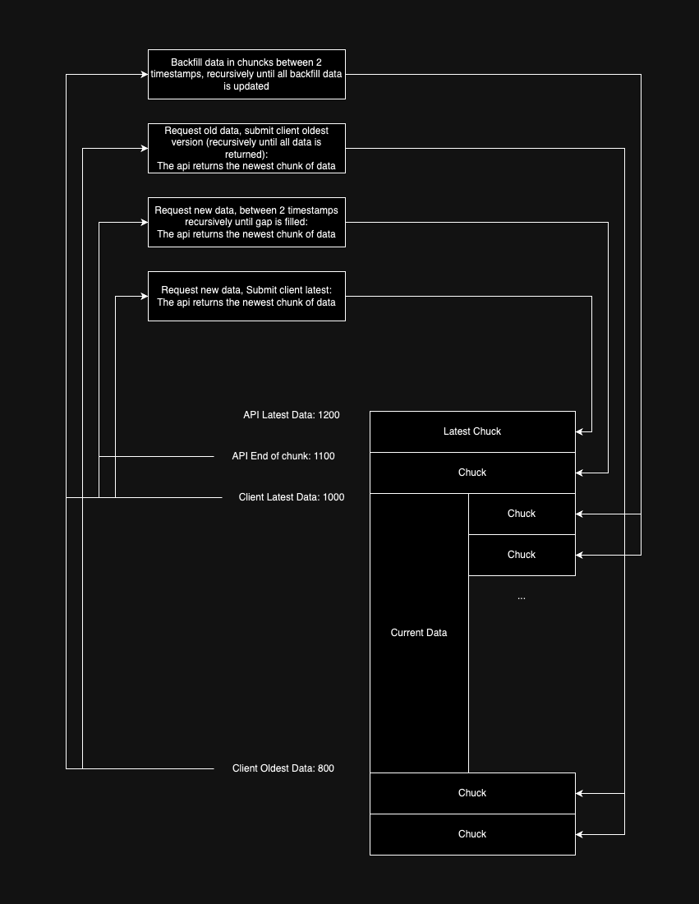

# REST API Documentation

The REST API allows clients to request bulk data efficiently. Due to the inefficiency of sockets with large data volumes and the lack of compression, the API is designed to handle these bulk requests effectively.

---

## Drawing



---

## Concept

The REST API operates on a pagination principle:

1. **Initial Data Request:**

    - When a client connects, it requests the newest data for a specific document type (this applies to all document types).
    - The API responds with the latest chunk of data for the requested document type (a chunk contains 100 documents).

2. **Sync Map Updates:**

    - After receiving the data chunk, the client updates its sync map to track the data that has already been synced.
    - The sync map helps identify gaps in the data, and the client starts requesting additional chunks to fill these gaps (refer to the diagram for visual representation).

3. **Merging Data Blocks:**

    - After receiving each chunk, the client:
        - Updates the sync map.
        - Merges overlapping blocks to maintain a clean and organized sync map.

4. **Stopping Requests:**
    - The client ceases data requests once it detects no new chunks are being returned by the API.

---

## Client Request Structure

A POST request is sent to the API (endpoint: `docs`) with the following structure:

```javascript
/**
 * Represents the structure of a client request.
 */
type ApiQuery = {
    apiVersion: string, // API version being used
    gapEnd?: number, // Optional: End timestamp for the data gap
    gapStart?: number, // Optional: Start timestamp for the data gap
    contentOnly?: boolean, // Optional: If true, returns only content data
    type?: string, // Optional: Document type requested
    accessMap: AccessMap, // Map tracking the client's access
};
```

---

## API Response Structure

The API responds with the following structure:

```javascript
/**
 * Represents the structure of an API response.
 */
type DbQueryResult = {
    docs: Array<any>, // Array of documents returned
    warnings?: Array<string>, // Optional: Warnings related to the query
    version?: number, // Optional: API version used
    blockStart?: number, // Optional: Start of the data block returned
    blockEnd?: number, // Optional: End of the data block returned
    accessMap?: AccessMap, // Optional: Updated access map
    type?: DocType, // Optional: Document type returned
    contentOnly?: boolean, // Optional: Indicates if only content was returned
};
```

---

## Requests

-   The API returns data based on the timestamps provided in the request:
    -   **Single Timestamp (gapStart):** If only `gapStart` is provided, the API returns the newest chunk of data.
    -   **Range (gapStart & gapEnd):** If both `gapStart` and `gapEnd` are provided, the API returns the newest chunk of data within the specified range.

---

## Authentication

Authentication is handled via a JWT token passed in the `Authorization` header of the POST request. This ensures secure communication between the client and the API.

-   If the client does not have a JWT, the API will only return public content to the user.

---
