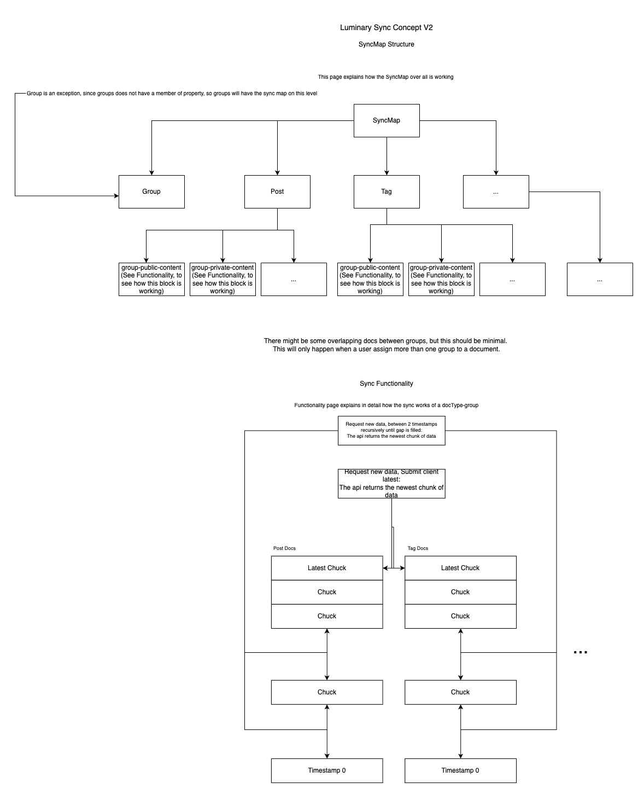

Here’s your formatted and checked REST API documentation, with some improvements for clarity and readability:

---

# REST API Documentation

The REST API enables clients to request bulk data efficiently. Designed to address the inefficiencies of sockets with large data volumes and the absence of compression, the API ensures optimal handling of bulk requests.

---

## Drawing



---

## SyncMap

The **SyncMap** is a structure stored in `indexDB` (specifically, the `LuminaryInternals` table). It tracks the data that has already been synchronized.

-   **Structure:**  
    The SyncMap structure, illustrated in the diagram, saves the sync progress for each `docType` by group.

-   **Notes:**
    1. An exception exists for groups. Since groups do not have a `memberOf` property, their sync progress is saved directly and not per group.

---

## Concept

The REST API operates on a **pagination-based synchronization principle**:

1. **Initial Data Request:**

    - When a client connects, it requests the newest data for a specific `docType`.
    - The API responds with the latest chunk of data (each chunk contains 100 documents).

2. **Sync Map Updates:**

    - After receiving a data chunk, the client updates its SyncMap to record synced data.
    - The SyncMap identifies gaps in the data, prompting the client to request additional chunks to fill these gaps. (Refer to the diagram for a visual representation.)

3. **Merging Data Blocks:**

    - After receiving each chunk, the client:
        - Updates the SyncMap.
        - Merges overlapping blocks to maintain an organized and compact SyncMap.

4. **Stopping Requests:**
    - The client halts further requests once it detects no new data chunks are being returned by the API.

---

## Client Request Structure

Clients send POST requests to the API (endpoint: `docs`) with the following structure:

```javascript
/**
 * Represents the structure of a client request.
 */
type ApiQuery = {
    apiVersion: string, // API version being used
    gapEnd?: number, // Optional: End timestamp for the data gap
    gapStart?: number, // Optional: Start timestamp for the data gap
    contentOnly?: boolean, // Optional: If true, returns only content data
    type?: string, // Optional: Document type requested
    accessMap: AccessMap, // Map tracking the client's access
};
```

---

## API Response Structure

The API responds with the following structure:

```javascript
/**
 * Represents the structure of an API response.
 */
type DbQueryResult = {
    docs: Array<any>, // Array of documents returned
    warnings?: Array<string>, // Optional: Warnings related to the query
    version?: number, // Optional: API version used
    blockStart?: number, // Optional: Start of the data block returned
    blockEnd?: number, // Optional: End of the data block returned
    accessMap?: AccessMap, // Optional: Updated access map
    type?: DocType, // Optional: Document type returned
    contentOnly?: boolean, // Optional: Indicates if only content was returned
};
```

---

## Requests

The API returns data based on the timestamps provided in the request:

-   **Single Timestamp (`gapStart`):**  
    If only `gapStart` is provided, the API returns the newest chunk of data.

-   **Range (`gapStart` & `gapEnd`):**  
    If both `gapStart` and `gapEnd` are provided, the API returns the newest chunk of data within the specified range.

---

## Authentication

Authentication is handled via a **JWT token** included in the `Authorization` header of the POST request. This ensures secure communication between the client and the API.

-   If the client does not provide a JWT, the API will return only public content.
