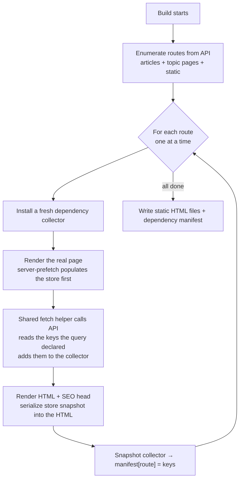
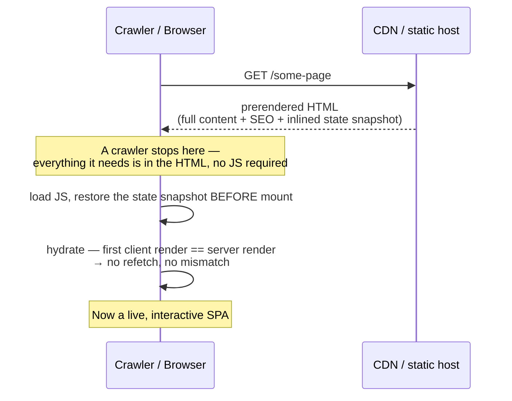
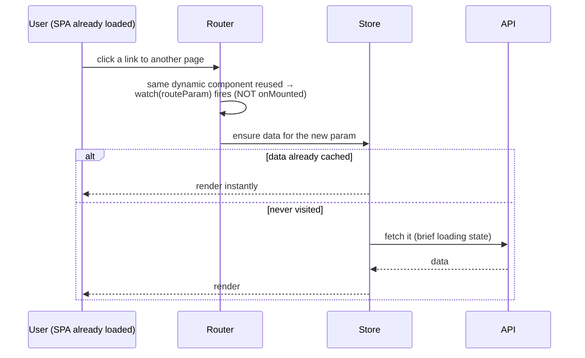
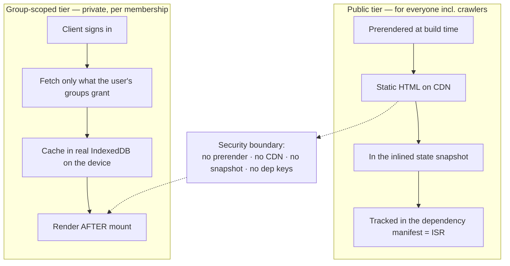
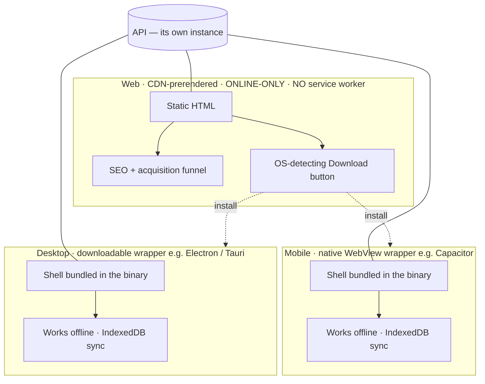
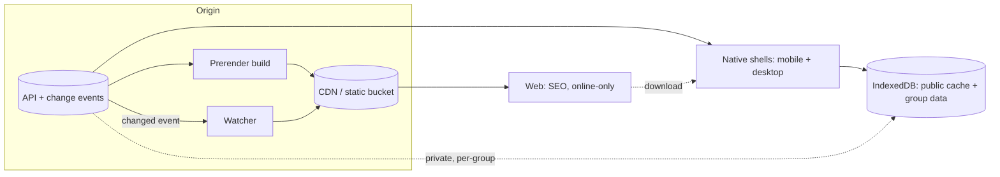

# Architecture Analysis & Decision Log

> **Companion to [`docs/design-specs/`](design-specs/).** The specs say *how* to
> build each phase. This document captures *what* we built, *why* (the decisions
> you made), and the system expressed as a set of **flows** — with diagrams you
> can lift straight into the main project.
>
> Diagrams below are [Mermaid](https://mermaid.js.org/). They render in GitHub /
> most Markdown tools, or paste them into the Mermaid Live Editor to export an
> image for a deck.

---

## 1. The thesis in one paragraph

A heavily client-rendered, offline-first app can be **fully discoverable by search
engines and social crawlers** by **prerendering its dynamic, API-driven content
into static HTML** (full content + SEO metadata, visible with JS disabled) that
then **hydrates cleanly** into the normal SPA. Once each page is treated as a
**cache keyed by the data it read**, you can compute **exactly which pages go
stale** on any content change and regenerate only those — driven automatically by
**change events**. Private, **group-scoped** data lives in a **separate tier**
that is never prerendered and is synced to the client; **offline** is provided by
**native shells** (mobile/desktop), not the web. One codebase, three delivery
surfaces.

---

## 2. Component inventory (by role, not file)

| Role | What it does |
| --- | --- |
| **Data source / API** | Single source of truth for content. Runs as its **own instance**. Serves queries, accepts mutations, emits change events. |
| **Prerender build** | Enumerates routes from the API and renders the real app once per route to static HTML. |
| **Shared fetch helper** | One code path used in both the build (SSR) and the browser. |
| **Store + initial-state transfer** | Server-prefetched data is serialized into the HTML and restored before mount → clean hydration. |
| **Head/metadata layer** | Per-page SEO tags (title, description, canonical, OG, Twitter, hreflang, JSON-LD) derived from fetched data. |
| **Dependency capture** | Each query response declares the keys it touched; the build records a `route → keys` manifest. |
| **Mutation layer** | Each mutation returns the `changedKeys` it affected (old ∪ new on re-categorize). |
| **Affected-set computer** | Intersects changed keys with the manifest → the stale route set. |
| **Scoped regeneration** | Re-renders only the stale routes; verifies isolation by content hash. |
| **Change event source** | Long-lived stream (SSE) that pushes `changed` events carrying `changedKeys`. |
| **Watcher** | Subscribes to events, debounces/coalesces, runs affected → scoped rebuild, triggers cache purge. |
| **Public tier** | Prerendered + dependency-tracked content (articles, topic pages, feeds). |
| **Group-scoped tier** | Private, access-controlled data; never prerendered; synced to client IndexedDB. |
| **Session layer** | Per-user identity/groups; kept out of the hydration snapshot; restored after mount. |
| **Platform shells** | Web (CDN), Mobile (native WebView wrapper), Desktop (downloadable wrapper). |

---

## 3. The flows (diagrams)

### 3.1 Build time — prerender + render-time dependency capture

### 3.2 Cold load — clean hydration (crawler + user)

### 3.3 In-app navigation — pure SPA (data on demand)

> **Lesson baked in:** for dynamic routes that reuse the same component
> (`/:slug → /:slug`), re-trigger fetching on **param change**, not just on mount
> — otherwise the page hangs on its loading state forever.

### 3.4 Content change → regeneration (the ISR loop)

```mermaid
flowchart LR
  M[Mutation<br/>create / edit / delete / re-categorize] --> RP[Data updated<br/>returns changedKeys]
  RP --> EV[API broadcasts a 'changed' event<br/>SSE, carrying changedKeys]
  EV --> Wv[Watcher<br/>debounce + coalesce, serialized]
  Wv --> AF[Compute affected =<br/>manifest ∩ changedKeys<br/>+ the item's own page]
  AF --> RB[Scoped rebuild<br/>re-render only stale routes<br/>hash-verified isolation]
  RB --> PB[Publish to CDN + purge affected paths]
  PB --> CV[Next cold visitor / crawler<br/>gets fresh static HTML]
```

> The watcher is a **separate process**. Nothing starts it implicitly — locally
> you run it yourself; in the container the entrypoint runs it alongside the
> preview. **The event firing does not rebuild anything by itself.**

### 3.5 Two data tiers (public vs group-scoped)

### 3.6 Multi-platform delivery topology

### 3.7 Master view (how the pieces connect)

---

## 4. Decision log — the calls you made

| # | Decision | Choice | Why | Consequence |
| --- | --- | --- | --- | --- |
| D1 | **Offline on the web?** | **No — web is online-only, no service worker** | A service worker conflicts with the native WebView runtime (Capacitor), and keeps the web always-fresh | Offline must come from native shells; web stays simple and never serves stale code |
| D2 | **Delivery surfaces** | **Web (CDN) + Mobile (Capacitor) + Desktop (downloadable)** | Web = discovery/SEO; native = the real, offline-capable app | Need a desktop wrapper (Capacitor can't build desktop) + a download funnel from web |
| D3 | **Desktop build** | **Downloadable wrapper (Electron-community or Tauri)** | Reuse the same SPA; offline via bundled shell | Pick by binary-size vs plugin-reuse; add an update channel |
| D4 | **Where the API runs** | **Its own separate instance** | Decouple data from the client/preview/build | Client, build, and watcher all reach it via a configurable base URL |
| D5 | **Data model** | **Two tiers: public (prerendered) vs group-scoped (private)** | They don't overlap — public is what everyone should find; private has no SEO value | No SEO-vs-privacy tension; private data is a hard security boundary |
| D6 | **Group-scoped storage + surface** | **Real IndexedDB + a dedicated client-only dashboard route** | Real offline persistence; clean separation from public pages | Adds an IndexedDB layer + a `noindex` client-only route |
| D7 | **Regeneration trigger** | **Event-driven (change event → watcher → scoped rebuild)** | Automatic, not manual; matches a write-heavy system | The watcher must be running; it's a separate process |
| D8 | **Topic pages** | **Prerendered + dependency-tracked** | Topics are public content with SEO value | +1 page per topic; tracked on the topic's key |
| D9 | **Load feel** | **Keep in-app navigation identical to direct loads** | Consistency over progressive polish | Declined card pre-seed / prefetch-on-hover |
| D10 | **Dataset characteristic** | **Treated as very dynamic / write-heavy** | Informs refresh + coalescing strategy | Favors instant propagation and debounced batching |

---

## 5. Explicitly NOT wanted (non-goals)

These are deliberate. An implementer should treat them as hard constraints.

- **No service worker on the web tier; no "offline web."** (D1)
- **No private/group-scoped data in any prerendered file, CDN artifact, state
  snapshot, or dependency manifest.** (D5)
- **No per-user / session / auth / offline state baked into the hydration
  snapshot**, and none rendered during the hydrating pass.
- **No prerendering of private/authenticated routes** — they are client-only.
- **No true per-route single-document live regeneration for v1** — a *scoped
  rebuild* of the stale subset is sufficient; treat single-page regen as a later
  optimization only if cost demands it.
- **Don't expect the mobile wrapper to emit a desktop binary** — use a desktop
  wrapper.
- **Don't treat IndexedDB as guaranteed-durable** for must-keep data (it can be
  evicted) — back critical data with native storage.

---

## 6. Explored & parked

- **Live client updates (no reload).** We built a path where the open tab
  subscribes to the change stream and re-fetches only the affected, currently-
  loaded slices in the background (invisible, stale-while-revalidate) — then
  **reverted it** to keep the surface minimal for now. It works and is documented
  conceptually in the Phase 2 thinking; revisit if "open tabs update without a
  reload" becomes a requirement. Key open choice if revived: refresh **on the
  mutation event** (instant; the live tab can briefly lead the static site) vs
  **after the rebuild completes** (live tab and static site stay in lockstep).

---

## 7. Gotchas & lessons (all verified during the build)

- **Hydration mismatch is only a risk on the *shared shell*.** Content that was
  never server-rendered (client-only routes) has nothing to mismatch against.
- **Dynamic-route component reuse:** `/:slug → /:slug` reuses the component;
  refetch on **param change**, not just mount, or the page hangs on loading.
- **A dev API in watch mode resets in-memory state on any server-file edit.**
  Don't edit server files mid-demo; don't rely on in-memory state surviving.
- **A change event ≠ a rebuild.** The watcher (a separate process) must be
  running to act on events; watching the event stream is not enough.
- **Delete doesn't remove a page by default** — scoped rebuild *re-renders* the
  stale set but doesn't *delete* files; removing a deleted item's own page needs
  explicit handling.
- **The HTTP cache is not offline.** Top-level navigations go to the network and
  fail closed; HTML is usually `no-cache`. Offline launch needs a service worker
  (ruled out) or a native bundle.
- **JS-disabled is the crawler's view**, and a useful test: public pages must show
  full content with JS off; private/client-only routes correctly show nothing.
- **Render pages one at a time during capture** (single shared collector) so keys
  attribute to exactly one route.
- **Keys must be scope-qualified** (language/locale/tenant) so a change in one
  scope never invalidates another's pages.

---

## 8. Open questions to settle in the main project

- **Re-categorize / membership-change fan-out:** confirm the mutation layer
  returns **old ∪ new** keys for every move, and measure the real fan-out.
- **Cache purge integration:** which paths to purge per change, and how (CDN API).
- **`dateModified` / freshness:** wire it to actual regeneration time.
- **Sitemap + robots** generation from the enumerated route list.
- **Content-less shell fallback** for client-only routes (kills the brief
  "wrong page" flash on direct loads; also the CDN fallback config).
- **Native update channel** (store / OTA) and **storage durability** for offline.
- **Live updates:** adopt or keep parked (Section 6).

---

## 9. Mapping to the design specs

| This analysis | Design spec |
| --- | --- |
| Flows 3.1–3.3, clean hydration, SEO tags | [Phase 1](design-specs/phase-1-prerendering-seo-hydration.md) |
| Flow 3.4, dependency keys, affected set, event loop | [Phase 2](design-specs/phase-2-dependency-tracking-regeneration.md) |
| Flows 3.5–3.6, two tiers, offline, platform split | [Phase 3](design-specs/phase-3-two-tier-data-offline-platforms.md) |
| Decision log (§4), non-goals (§5) | The "Non-goals" + "Key decisions" sections in each phase |

---

*Status: retrospective of a successful POC. Use the flows in §3 as the basis for
the architecture diagram; use §4–§5 to defend the decisions when proposing.*
